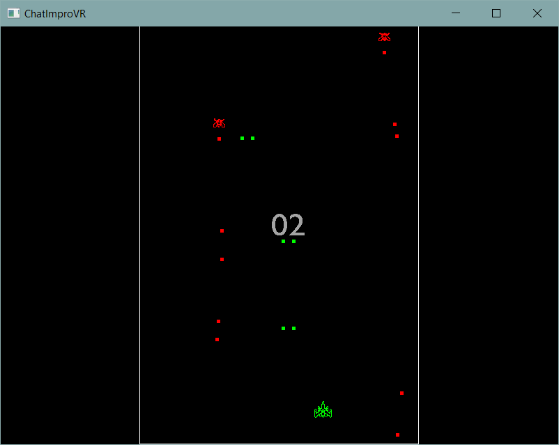

# Beginner Plugin Development Tutorial

In this section, we will go over the basic understanding of plugin development (for beginners). This tutorial will go in depth with strong example codes and explaination of the meaning the syntax. 

It's assumed that you have read through the Core Concepts section.

By following this tutorial, you will able to create a knock-off version of **Galaga**. The final version can be found in this [repository](https://github.com/ChatImproVR/galaga). The complete game view we be something similar as the image below.

Any beginner with some background of Rust language should be able to follow this tutorial without any issue. If you need some help getting set up with Rust, you can refer to the [Rust Book](https://doc.rust-lang.org/book/).
