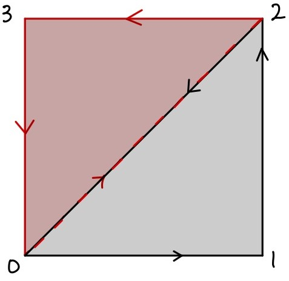
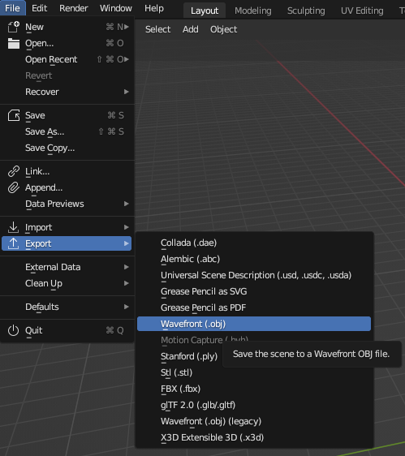
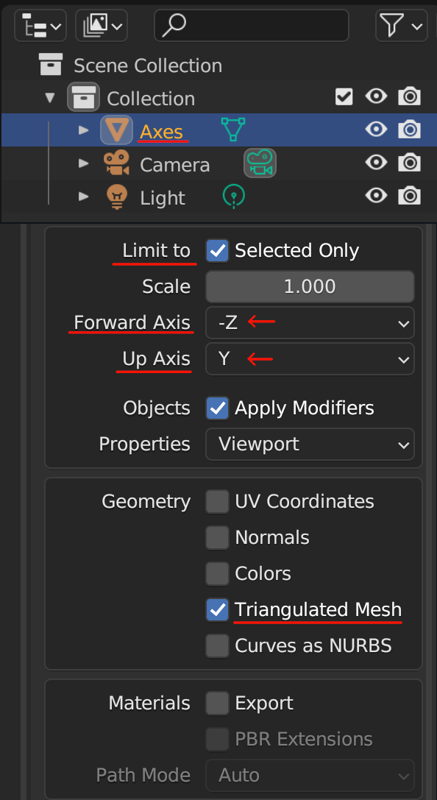

# Creating Objects

Now we have our template of the plugin and have some knowledge on what is going on, let's start working on object creation. Without any objects in the environment, we cannot do anything with it.

## Review

Before we start adding code into the plugin, let's review what is an ECS. Please refer to this [page](../Core_Concepts/entity_component_system.md).

In short, we need to have ID for each object that is associated with each graphic itself.

## Adding packages/libraries/crates

Insert the following packages/libraries/crates (We will call them crates for now on) into the very top of `lib.rs` file.

```rust
use cimvr_engine_interface::{make_app_state, prelude::*, pkg_namespace};

use cimvr_common::{
    glam::{EulerRot, Quat, Vec3},
    render::{Mesh, MeshHandle, Primitive, Render, UploadMesh, Vertex},
    Transform,
};
```
Some of the crates are familiar from the plugin template such as `make_app_state` or `prelude::*`. Here is a brief summary on the remaining crates.
- `pkg_namespace`: This allows us to easily and uniquely name component and message data types based on our crate's (plugin's) name.
- `cimvr_common`: The main crate that handles communcation between server and client.
    - `render`: The main crate for object loading part (the main itself explains that it will render graphics)
        - `Mesh`: This will contain both vertices and indices: **This will be important later on the object creation part**.
        - `MeshHandle`: This handle refers to a mesh without containing its data
        - `Primitive`: This will describe the method of rendering the object: **This is important when it comes to object creation**.
        - `Render`: This component is the most important for rendering; it tells the rendering engine how to render the given `MeshHandle`.
        - `UploadMesh`: This will send the mesh to the client.
        - `Vertex`: It contains the coordinates and rgb value and/or texture coordinates for a given vertex.
    - `Transform`: The will set the position and orientation of the object.

## Create ID For Each Object

First, we need to declare the `MeshHandle` to assign each ID for each object. In the game of galaga, we need to assign four parts: player, enemy, player's bullet, and enemy's bullet.

We can set up the ID value like the following.
```rust
const PLAYER_HANDLE : MeshHandle = MeshHandle::new(pkg_namespace!("Player"));
const ENEMY_HANDLE : MeshHandle = MeshHandle::new(pkg_namespace!("Enemy"));
const PLAYER_BULLET_HANDLE : MeshHandle = MeshHandle::new(pkg_namespace!("Player Bullet"));
const ENEMY_BULLET_HANDLE : MeshHandle = MeshHandle::new(pkg_namespace!("Enemy Bullet"));
```
Each line represents the ID for each entity/object. We will declare a constant value that it is a MeshHandle with the name holder of the object using the `pkg_namespace`. 
These variables should not be declare in ServerState nor ClientState.

## Setting up the Mesh for Each Object
Now we have declare the MeshHandle, we need to create the Mesh itself, or the object itself.

If you want to use `Blender` to create an object and upload that as a mesh into the plugin, please refer the [Blender](/Beginner_Tutorial/creating_objects.md#blender) section that is below this section.

Let's start making the player object itself. Our design, since it is a basic model, will be a sqaure for the player.
First, we declare a function that returns a Mesh type.
```rust
fn player() -> Mesh {}
```

Inside the function, we need to define how big we want to be.
For now, let's define the size variable inside the player function as 5.0.

```rust
fn player() -> Mesh {
    let size = 5.0;
}
```
Inside a Mesh, there is vertices and indices that we need to define and return.
Let's take a look at the Vertex data type.
```rust
pub struct Vertex {
    /// Local position
    pub pos: [f32; 3],
    /// Either u, v, w for textures or r, g, b for colors
    pub uvw: [f32; 3],
}
```
From this point, we will deviate into two sections: 2D and 3D. First we will cover the 2D section. If you want to get information regarding 3D, please refer to [this section](/Beginner_Tutorial/creating_objects.md#3d), but we highly recommend to read the 2D section first.

### 2D
As you see above, the Vertex takes [x,y,z] position and [r,g,b] color combination.
The word vertex means a point. We are poviding the point value of the object. Because we decided to make the player as a sqaure rather than fancy object looking, it can define as the following.
```rust
let vertices = vec![
        Vertex::new([-size, -size, 0.0], [0.0, 0.0, 1.0]), // Vertex 0
        Vertex::new([size, -size, 0.0], [0.0, 0.0, 1.0]), // Vertex 1
        Vertex::new([size, size, 0.0], [0.0, 0.0, 1.0]), // Vertex 2
        Vertex::new([-size, size, 0.0], [0.0, 0.0, 1.0]), // Vertex 3
    ];
```
The variable vertices is vector that contains several vertext of the object itself.
Inside the first Vertex variable, the first array is define as the position of the vertex location whereas the second array is the rgb value. Since we define the value `size` previously, we can use the value in the x and y value. We are not creating a 3D galaga game, which there is no need to insert a z value. Therefore, the z value is `0.0` rather than some other numerical value.

For the rgb value, we are using the scale between 0.0 to 1.0 rather than the traditional of 0 to 255. If you want to get the exact value of the rgb value based on the scale between 0 to 255, you can simply do the value desire over 255. For example, if you want to have a certain red value (like 200), the math will be 200/255 which results to 0.7843137255. In this case, we are setting the player object as blue.

Now let's switch our focus to the indices. We need to place the vertex by following the **Right Hand Rule**. For people who do not know what is the Right Hand Rule, it can be explain the image below.


Let's say the green arrow represents the x-axis, the blue arrow represents the y-axis, and the red arrow represents the z-axis. If we place the vertex in the counter clockwise order for both x and y values, then the z value will be positive that will be facing us. If we place the order of the vertex in the opposite order/ clockwise, then it will face down. Since we want to place the object facing toward us, we need to place the vertices in the counter clockwise order.

Therefore, the indices variable will be define as below.
```rust
let indices: Vec<u32> = vec![0,1,2,2,3,0];
```
The 0, 1, 2, 3 came from the Vertex 0, Vertex 1, Vertex 2, and Vertex 3 that is describe above. Vertex 0 is the bottom left corner; Vertex 1 is the bottom right corner; Vertex 2 is upper right corner; and Vertex 3 is the upper left corner of the square.

Here is an example drawing on how it will be displayed.



Lastly, we need to return the value of Mesh type as the following.
```rust 
Mesh {vertices, indices}
```

Therefore the complete version of the player mesh function will be define as following.

```rust
fn player() -> Mesh {
    let size: f32 = 5.0;

    let vertices = vec![
        Vertex::new([-size, -size, 0.0], [0.0, 0.0, 1.0]), // Vertex 0
        Vertex::new([size, -size, 0.0], [0.0, 0.0, 1.0]), // Vertex 1
        Vertex::new([size, size, 0.0], [0.0, 0.0, 1.0]), // Vertex 2
        Vertex::new([-size, size, 0.0], [0.0, 0.0, 1.0]), // Vertex 3
    ];

    let indices: Vec<u32> = vec![0,1,2,2,3,0];

    Mesh {vertices, indices}
}
```
For each object, we need to the followng for the remaining enemy. enemy's bullet, and player's bullet. If you want to learn more depth regarding drawing objects, here is a [great resource](https://learnopengl.com/Getting-started/Hello-Triangle) to refer.

### 3D
With the same approach as creating 2D objects, we need to increase more vertex and identify which indices will connect to which indices. The following code will make a cube instead of a sqaure.

```rust
/// Defines the mesh data fro a cube
fn cube() -> Mesh {
    // Size of the cube mesh
    let size = 0.25;

    // List of vertex positions and colors
    let vertices = vec![
        Vertex::new([-size, -size, -size], [0.0, 1.0, 1.0]),
        Vertex::new([size, -size, -size], [1.0, 0.0, 1.0]),
        Vertex::new([size, size, -size], [1.0, 1.0, 0.0]),
        Vertex::new([-size, size, -size], [0.0, 1.0, 1.0]),
        Vertex::new([-size, -size, size], [1.0, 0.0, 1.0]),
        Vertex::new([size, -size, size], [1.0, 1.0, 0.0]),
        Vertex::new([size, size, size], [0.0, 1.0, 1.0]),
        Vertex::new([-size, size, size], [1.0, 0.0, 1.0]),
    ];

    // Each 3 indices (indexing into vertices) define a triangle
    let indices = vec![
        3, 1, 0, 2, 1, 3, 2, 5, 1, 6, 5, 2, 6, 4, 5, 7, 4, 6, 7, 0, 4, 3, 0, 7, 7, 2, 3, 6, 2, 7,
        0, 5, 4, 1, 5, 0,
    ];

    Mesh { vertices, indices }
}
```

## Sending the Mesh from Client to Server
Once we have generated the Mesh for each object with the correct Render ID, we need to send that Mesh with the correct ID to the server. Inside the new function below, we need to insert the following command.

```rust
io.send(&UploadMesh{
    id: PLAYER_HANDLE,
    mesh: player(),
});

```
Let's take a deep look into this command itself.

The command will send to the EngineIo as a `UploadMesh` struct that contains the Render ID and the mesh itself. We know both of the id (`PLAYER_HANDLE`) and the mesh (`player()`). 

That is all for sending mesh from the client to the server. Pretty easy. The complete code will be looking similar below. This implementation is inside the `ClientState` `new` function. 

```rust
fn new(io: &mut EngineIo, sched: &mut EngineSchedule<Self>) -> Self {
        io.send(&UploadMesh{
            id: PLAYER_HANDLE,
            mesh: player(),
        });

        Self
}
```
You do the same process for all the remaining objects such as the enemy, enemy_bullets, and the player_bullets.

## Blender
While using Mesh is great by declearing a type and modify from there, it is very limited to the extend of creating more unique objects. Therefore, we have a different method to implement mesh into the plugin using `Blender`!

The object loader is already part of CimVR that we just need to update the `Cargo.toml` file. Inside the `Cargo.toml` file of your plugin, add a new line under dependencies.

```rust
obj_reader = {path = "../chatimprovr/obj_loader"} // The path might look different 
```
You can declare whatever you want, but make sure the path is located in the right file that will read the file. 

Once that is complete, you need to use that crate to load the function `obj_lines_to_mesh`.

At the beginning of the `lib.rs` file where you declare crates, add the following line.

```rust
// Add libraries from the obj_reader crate
use obj_reader::obj::obj_lines_to_mesh;
// If you name the dependency differently, then change the name accordingly
```

## Differences between Blender and ChatImproVR
The biggest differences between Blender and ChatImproVR is axes are different. Take a look at the following image below.


The color lines represent axes in ChatImproVR whereas the solid white lines with the labels for each axes represent the axes in Blender.
For people who are not familiar with the color line axes representation, here is a summary about it.
- Red Line represents the **X-axis**
- Green Line represents the **Y-axis**
- Blue Line represents the **Z-axis**
- The Solid Lines represent **positive** direction
- The Dotted Lines represent **negative** direction

As you see, the blender axes does not match with the ChatImproVR axes; for example, the Y-axis for blender is on the Z-axis for ChatImproVR. Therefore, we need to make sure to export the object correctly so that we do not need to modify the object viewing inside the code (In this tutorial, we had to modify to show other features; hence, we highly recommed to follow this section.)

For the biggest difference is that the **negative Y-axis** in **Blender** is **positive Z-axis** in **ChatImproVR** whereas **positive Z-axis** in **Blender** is **positive Y-axis** in **ChatImproVR**.

## How to Create an Object in Blender and Export Correctly
Now we know what is the major differences, how do we export the object correctly using blender? First, we need to create an object in Blender. There are many tutorials on how to make an object of whatever design you prefer. Once the object has been created in Blender, follow the next steps.
1. In **File**, select **Export**, then select **Wavefront** like the image below. It should have the file type as **(.obj)**





2. Match the option as the image below.



3. Once that settings is correct, then select export to your desired location with the desired object file name. In our case, we are going to save it in `src/assets`.

## How to send an Object from Blender from Client to Server
The process of sending a object mesh from Blender from client to server is very similar like how you send a mesh that is created inside the plugin. Inside the `new` function, insert the following code.
```rust
io.send(&UploadMesh {
            id: ENEMY_HANDLE,
            mesh: obj_lines_to_mesh(include_str!("assets/circle.obj")),
        });
```

The only difference between the previous method and this method is the `mesh` component: instead of custom created mesh, we are using the `obj_lines_to_mesh` function to load the mesh. In the example above, by inserting the `obj_lines_to_mesh` function with the argument of the path of object file (in this case will be the `circle.obj` file), it will load properlly.

Once that is complete, then we have sent the Render ID and mesh to the server. For this plugin, we will using the player and enemies as of now. We will add more objects mesh as we continue the tutorial.

## How to display the Object from the Server
Based on the client side code, we are just sending the Render ID to the server, not the mesh data itself. Therefore, in order to render the entity we want to display, we need to call the Render ID while we are creating the entity.

## So, how do you create an entity?
In the `ServerState` implementation, we will add the following commands inside the `new` function for creating the player entity.

```rust
// Create Player entity with components
        io.create_entity()
            // Add the render component to draw the player with lines
            .add_component(Render::new(PLAYER_HANDLE).primitive(Primitive::Lines))
            // Add the synchronized component to synchronize the entity with the client side
            .add_component(Synchronized)
            // Add the transform component for movement
            .add_component(Transform::default())
            // Build the entity
            .build();
```
We can split into (technically two) three functions when creating the entity using `io`. The first line `.create_entity()` tells the server that we are creating an entity. The second to fourth line that contains the function `.add_component` is the method of adding component as name states. In layman terms, we are adding characteristics to the entity. The last line that contains the `.build();` tells the server that we are done adding component to this entity and build it.

The most important function when creating is `.add_component()` function call. In the code/example above, there are three unique calls, which will cover each part in depth.

### Render
When you add this component to a certain entity, it indicates that we are giving an render data to this entity that could appear on the client side. This is where we use the Render ID to render the entity that was sent from the client side. In the given example, we are going to render this entity as a player by providing the `PLAYER_HANDLE` Render ID to the entity. This explains up to the part of `.add_component(Render::new(PLAYER_HANDLE))`.

The `.primitive(Primitive::Lines)` part explains what method are we going to render. There are three methods to render the entity: `Lines`, `Points`, or `Triangles`. The name itself explains how it will be render except `Triangles`. The `Triangles` method use the idea of the right hand rule that by providing the three vertices to format as a triangle will fill out the area with the given color. In this case, because the player ship is created over blender with only lines, the example says Lines, but if you want to render in a different method, you are welcome to do so.

### Synchronized
When you add this component to a certain entity, it indicates that whatever happens to the server will also update on the client side as well. We want to have this component; for example, if the player is hit from the enemy's bullet, then the player must be deleted, but if we do not have this component, the client will never know when it should be deleted or not.

If the client do not care regarding updates from the server side, then you do not need to add this component. Otherwise, must add this component.
### Transform
When you add this component to a certain entity, it indicates that this entity will be display on the client side whether or not it has a mesh data. This component seems somewhat redundent and useless at first because the entity will be display even without any render data; in other words, why would call this component if you do not need to render something. However, the transform allows you to do a lot of customization when it comes to positioning and rotation, which will cover in the next section.


## Customizing the render settings
Take a good look at the following example code below.
```rust
// Create Player entity with components
        io.create_entity()
            // Add the transform component for movement
            .add_component(
                // Add the default transform component
                Transform::default()
                    // Set the bottom middle of the screen as the initial position
                    .with_position(Vec3::new(0.0, -50.0, 0.0))
                    // Set the initial rotation to be facing towards to the player based on the camera angle (no needed if you create the object facing a different direction)
                    .with_rotation(Quat::from_euler(EulerRot::XYZ, PI/2., 0., 0.)),
            )
            // Add the render component to draw the player with lines
            .add_component(Render::new(PLAYER_HANDLE).primitive(Primitive::Lines))
            // Add the synchronized component to synchronize the entity with the client side
            .add_component(Synchronized)
            // Build the entity
            .build();
```
There are two things you have noticed:
1. The order of adding the component is different than the previous example. This tells that adding the component order does not matter what so ever. 
2. There are more functions from the `Transform` component.

Within each call for adding new components, you can set even more options in depth of the entity. In this example, we want to set the component location below the screen, where the player should be located. Therefore, we add te `.with_position()` function call with a `Vec3` input value of the position. Since it should be display in the bottom middle screen, the position will be `Vec3(0.,-50.,0.)`.

Because the object is created by Blender with the `xyz` reference is relative rather than objective, there is a need to rotate the object based on the X-axis by 90 degrees in radines (which it is PI/2). Therefore, we also need to call `.with_roation()` with the value of `Quat::from_euler(EulorRot::XYZ,PI/2.,0.,0.)`. At the same time, we need to add the PI value from the standard libary. Therefore, add the `use std::{f32::consts::PI};` in the beginning of the file.

We will create entities for enemy as well: NOT THE BULLET.

## Wait...? What about the bullets?
In the new function inside the ServerState, we have generated the entities for Player and Enemy, but not the bullets. Why?

The new function will generate the entity when the program starts. In other words, when the program starts, the entity (if we add the componenet to display) will display at the beginning, which it is not the case for bullets. We want to create and remove the bullets when the player press a certain button to shoot the bullet or the enemy decides to shoot the bullet. 

Therefore, we are going to generate the bullet based on certain function input. We will go in depth about it, but we can simply ignore the bullet at this point.

## Configuring the Camera Angle
Inside the engine's example plugins, there are several plugins that you can refer to. One of the example plugin that we are using is `camera2d` plugin. This plugin will automatically set the camera angle as a 2D angle. Therefore, if you want to see the current progress, all you need to do (after compiling the galaga code) is entering the following.

`cimvr galaga camera2d` or `cimvr camera2d galaga`. The order does not matter when it comes to calling the plugin.

If you want to customize the camera in your own angle, please refer the documentation in the camera utility.

## Summary/Current Code Progress
The following code should be similar to the code that is provided.

```rust
use std::{f32::consts::PI};

// Add libraries from the cimvr_engine_interface crate
use cimvr_engine_interface::{make_app_state, pkg_namespace, prelude::*};

// Add libraries from the cimvr_common crate
use cimvr_common::{
    glam::{EulerRot, Quat, Vec3},
    render::{Mesh, MeshHandle, Primitive, Render, UploadMesh, Vertex},
    Transform,
};

// Add libraries from the obj_reader crate
use obj_reader::obj::obj_lines_to_mesh;

// Create some constant value for Windows
const WITDH: f32 = 80.;
const HEIGHT: f32 = 120.;

// Create some constant values for Enemy
const ENEMY_SIZE: f32 = 3.; 

// Create some constant values for Player
const PLAYER_SIZE: f32 = 3.; // Because of the obj file, this value is not used (update this value after changing the obj size)

// Create some constant values for Bullet
const BULLET_SIZE: f32 = 0.5;


// Create mesh handleer based on each object's name
const PLAYER_HANDLE: MeshHandle = MeshHandle::new(pkg_namespace!("Player"));
const ENEMY_HANDLE: MeshHandle = MeshHandle::new(pkg_namespace!("Enemy"));
const PLAYER_BULLET_HANDLE: MeshHandle = MeshHandle::new(pkg_namespace!("Player Bullet"));
const ENEMY_BULLET_HANDLE: MeshHandle = MeshHandle::new(pkg_namespace!("Enemy Bullet"));
const WINDOW_SIZE_HANDLE: MeshHandle = MeshHandle::new(pkg_namespace!("Window Size"));

// Create Meshes for each object

// Create the Player Mesh --> This is commented out because we are using obj file
// fn player() -> Mesh {
//     let size: f32 = PLAYER_SIZE;

//     let vertices = vec![
//         Vertex::new([-size, -size, 0.0], [0.0, 0.0, 1.0]), // Vertex 0
//         Vertex::new([size, -size, 0.0], [0.0, 0.0, 1.0]),  // Vertex 1
//         Vertex::new([size, size, 0.0], [0.0, 0.0, 1.0]),   // Vertex 2
//         Vertex::new([-size, size, 0.0], [0.0, 0.0, 1.0]),  // Vertex 3
//     ];

//     let indices: Vec<u32> = vec![3, 0, 2, 1, 2, 0];

//     Mesh { vertices, indices }
// }

// // Create the Enemy Mesh --> This is commented out because we are using obj file
// fn enemy() -> Mesh {
//     let size: f32 = ENEMY_SIZE;

//     let vertices = vec![
//         Vertex::new([-size, -size, 0.0], [1.0, 0.0, 0.0]), // Vertex 0
//         Vertex::new([size, -size, 0.0], [1.0, 0.0, 0.0]),  // Vertex 1
//         Vertex::new([size, size, 0.0], [1.0, 0.0, 0.0]),   // Vertex 2
//         Vertex::new([-size, size, 0.0], [1.0, 0.0, 0.0]),  // Vertex 3
//     ];

//     let indices: Vec<u32> = vec![3, 0, 2, 1, 2, 0];

//     Mesh { vertices, indices }
// }

// Create Player Bullet Mesh as a sqaure green
fn player_bullet() -> Mesh {
    let size: f32 = BULLET_SIZE;

    let vertices = vec![
        Vertex::new([-size, -size, 0.0], [0.0, 1.0, 0.0]),
        Vertex::new([size, -size, 0.0], [0.0, 1.0, 0.0]),
        Vertex::new([size, size, 0.0], [0.0, 1.0, 0.0]),
        Vertex::new([-size, size, 0.0], [0.0, 1.0, 0.0]),
    ];

    let indices: Vec<u32> = vec![3, 0, 2, 1, 2, 0];

    Mesh { vertices, indices }
}

// Create Enemy Bullet Mesh as a sqaure red
fn enemy_bullet() -> Mesh {
    let size: f32 = BULLET_SIZE;

    let vertices = vec![
        Vertex::new([-size, -size, 0.0], [1.0, 0.0, 0.0]),
        Vertex::new([size, -size, 0.0], [1.0, 0.0, 0.0]),
        Vertex::new([size, size, 0.0], [1.0, 0.0, 0.0]),
        Vertex::new([-size, size, 0.0], [1.0, 0.0, 0.0]),
    ];

    let indices: Vec<u32> = vec![3, 0, 2, 1, 2, 0];

    Mesh { vertices, indices }
}

// Create Window Mesh so that the users will know what is the limit of movement
fn window_size() -> Mesh {
    let vertices = vec![
        Vertex::new([-WITDH / 2., -HEIGHT / 2., 0.0], [1.; 3]),
        Vertex::new([WITDH / 2., -HEIGHT / 2., 0.0], [1.; 3]),
        Vertex::new([WITDH / 2., HEIGHT / 2., 0.0], [1.; 3]),
        Vertex::new([-WITDH / 2., HEIGHT / 2., 0.0], [1.; 3]),
    ];

    let indices: Vec<u32> = vec![3, 0, 0, 1, 1, 2, 2, 3];

    Mesh { vertices, indices }
}

#[derive(Default)]
struct ClientState;

impl UserState for ClientState {
    // Implement a constructor
    fn new(io: &mut EngineIo, sched: &mut EngineSchedule<Self>) -> Self {
        // Declare the player color as green
        let player_color = [0., 1., 0.];

        // Read the player object file from the assets folder (that is created from blender)
        let mut new_player_mesh = obj_lines_to_mesh(&include_str!("assets/galagaship.obj"));

        // Update the player object/mesh with the player color
        new_player_mesh
            .vertices
            .iter_mut()
            .for_each(|v| v.uvw = player_color);

        // Declare the enemy color as red
        let enemy_color = [1., 0., 0.];

        // Read the enemy object file from the assets folder (that is created from blender)
        let mut new_enemy_mesh = obj_lines_to_mesh(&include_str!("assets/galaga_enemy.obj"));

        // Update the enemy object/mesh with the enemy color
        new_enemy_mesh
            .vertices
            .iter_mut()
            .for_each(|v| v.uvw = enemy_color);

        // Send the player mesh and the player mesh handler to the server side
        io.send(&UploadMesh {
            id: PLAYER_HANDLE,
            mesh: new_player_mesh,
        });

        // Send the enemy mesh and the enemy mesh handler to the server side
        io.send(&UploadMesh {
            id: ENEMY_HANDLE,
            mesh: new_enemy_mesh,
        });

        // Send the player bullet mesh and the player bullet mesh handler to the server side
        io.send(&UploadMesh {
            id: PLAYER_BULLET_HANDLE,
            mesh: player_bullet(),
        });

        // Send the enemy bullet mesh and the enemy bullet mesh handler to the server side
        io.send(&UploadMesh {
            id: ENEMY_BULLET_HANDLE,
            mesh: enemy_bullet(),
        });

        // Send the window mesh and the window mesh handler to the server side
        io.send(&UploadMesh {
            id: WINDOW_SIZE_HANDLE,
            mesh: window_size(),
        });

        Self::default()
    }
}

// All state associated with server-side behaviour
struct ServerState;

// Implement server only side functions that will update on the server side
impl UserState for ServerState {
    // Implement a constructor
    fn new(io: &mut EngineIo, sched: &mut EngineSchedule<Self>) -> Self {

        // Create Player entity with components
        io.create_entity()
            // Add the transform component for movement
            .add_component(
                // Add the default transform component
                Transform::default()
                    // Set the bottom middle of the screen as the initial position
                    .with_position(Vec3::new(0.0, -50.0, 0.0))
                    // Set the initial rotation to be facing towards to the player based on the camera angle (no needed if you create the object facing a different direction)
                    .with_rotation(Quat::from_euler(EulerRot::XYZ, PI/2., 0., 0.)),
            )
            // Add the render component to draw the player with lines
            .add_component(Render::new(PLAYER_HANDLE).primitive(Primitive::Lines))
            // Add the synchronized component to synchronize the entity with the client side
            .add_component(Synchronized)
            // Build the entity
            .build();

        // Create Enemy with components
        io.create_entity()
            // Add the transform component for movement, firing, and displaying
            .add_component(
                // Add the default transform component
                Transform::default()
                    // Set the top middle of the screen as the initial position
                    .with_position(Vec3::new(0.0, 50.0, 0.0))
                    // Set the initial rotation to be facing towards to the player based on the camera angle
                    // (no needed if you create the object facing a different direction or differen angle rotation)
                    .with_rotation(Quat::from_euler(EulerRot::XYZ, 90., 0., 0.)),
            )
            // Add the render component to draw the enemy with lines
            .add_component(Render::new(ENEMY_HANDLE).primitive(Primitive::Lines))
            // Add the synchronized component to synchronize the entity with the client side
            .add_component(Synchronized)
            // Build the entity
            .build();

        // Create the Window entity with components
        io.create_entity()
            // Add the transform component for displaying the window
            .add_component(Transform::default())
            // Add the render component to draw the window with lines
            .add_component(Render::new(WINDOW_SIZE_HANDLE).primitive(Primitive::Lines))
            // Add the synchronized component to synchronize the entity with the client side
            .add_component(Synchronized)
            // Build the entity
            .build();
    Self
    }
}

// Defines entry points for the engine to hook into.
// Calls new() for the appropriate state.
make_app_state!(ClientState, ServerState);
```

By having this code, you should get something similar like the following.


The bottom object in the screen is the player whereas the red object that is near the top of the screen is the enemy. It does not have to be the same shape, but if each object is define as player and enemy, then we are good shape.

If you are not getting similar view, then please let us know so that we can help you out. Otherwise, we are ready to move to the next section.