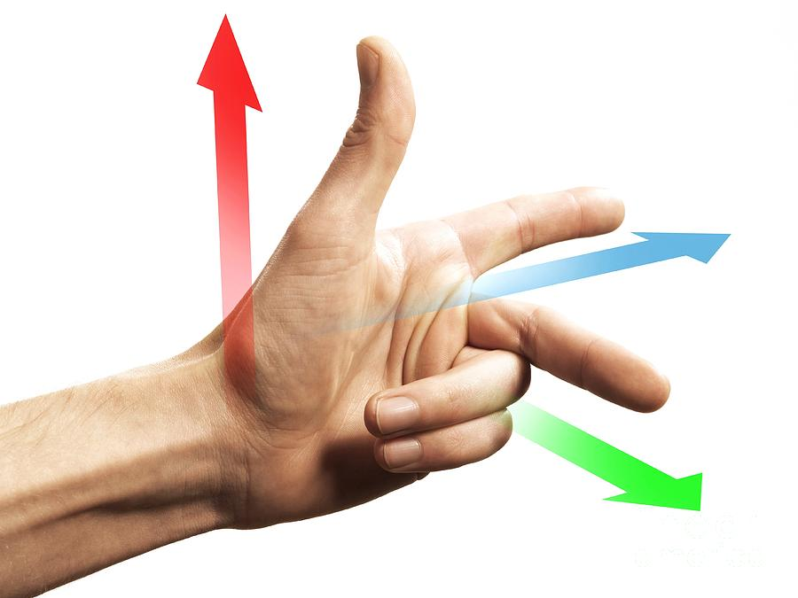

# Creating Objects

Now we have our template of the plugin and have some knowledge on what is going on, let's start working on object creation. Without any objects in the environment, we cannot do anything with it.

## Review

Before we start adding code into the plugin, let's review what is an ECS. Please refer to this [page](../Core_Concepts/core_concepts.md#entity-component-system).

In short, we need to have ID for each object that is associated with each graphic itself.

## Adding packages/libraries/crates

Insert the following packages/libraries/crates (We will call them crates for now on) into the very top of `lib.rs` file.

```rust
use cimvr_engine_interface::{make_app_state, prelude::*, pkg_namespace};

use cimvr_common::{
    render::{
        Mesh,
        MeshHandle,
        Primitive,
        Render,
        UploadMesh,
        Vertex,
    },
    Transform
};
```
Some of the crates are familiar from the plugin template such as `make_app_state` or `prelude::*`. Here is a brief summary on the remaining crates.
- `pkg_namespace`: Name holder of the ID of the entity. We will explain and use this part in more detail.
- `cimvr_common`: The main crate that handles communcation between server and client.
    - `render`: The main crate for object loading part (the main itself explains that it will render graphics)
        - `Mesh`: This will contain both vertices and indices: **This will be important later on the object creation part**.
        - `MeshHandle`: This will contain both the Mesh itself and the entity ID.
        - `Primitive`: This will describe the method of rendering the object: **This is another component that it is important when it comes to object creation**.
        - `Render`: This will render based on the entity ID and the Mesh that was given.
        - `UploadMesh`: This will send the mesh to the server or client.
        - `Vertex`: As the name itself, this is the vertext crate. In this vertex crate, it will contain the coordinates and rgb value.
    - `Transform`: The will set the position of the object.

## Create ID For Each Object

First, we need to declare the `MeshHandle` to assign each ID for each object. In the game of galaga, we need to assign four parts: player, enemy, player's bullet, and enemy's bullet.

We can set up the ID value like the following.
```rust
const PLAYER_HANDLE : MeshHandle = MeshHandle::new(pkg_namespace!("Player"));
const ENEMY_HANDLE : MeshHandle = MeshHandle::new(pkg_namespace!("Enemy"));
const PLAYER_BULLET_HANDLE : MeshHandle = MeshHandle::new(pkg_namespace!("Player Bullet"));
const ENEMY_BULLET_HANDLE : MeshHandle = MeshHandle::new(pkg_namespace!("Enemy Bullet"));
```
Each line represents the ID for each entity/object. We will declare a constant value that it is a MeshHandle with the name holder of the object using the `pkg_namespace`. 
These variables should not be declare in ServerState nor ClientState.

## Setting up the Mesh for Each Object
Now we have declare the MeshHandle, we need to create the Mesh itself, or the object itself.

Let's start making the player object itself. Our design, since it is a basic model, will be a sqaure for the player.
First, we declare a function that returns a Mesh type.
```rust
fn player() -> Mesh {}
```

Inside the function, we need to define how big we want to be.
For now, let's define the size variable inside the player function as 0.5.

```rust
fn player() -> Mesh {
    let size = 0.5;
}
```
Inside a Mesh, there is vertices and indices that we need to define and return.
Let's take a look at the Vertex data type.
```rust
pub struct Vertex {
    /// Local position
    pub pos: [f32; 3],
    /// Either u, v, w for textures or r, g, b for colors
    pub uvw: [f32; 3],
}
```
As you see above, the Vertex takes [x,y,z] position and [r,g,b] color combination.
The word vertex means a point. We are poviding the point value of the object. Because we decided to make the player as a sqaure rather than fancy object looking, it can define as the following.
```rust
let vertices = vec![
        Vertex::new([-size, -size, 0.0], [0.0, 0.0, 1.0]), // Vertex 0
        Vertex::new([size, -size, 0.0], [0.0, 0.0, 1.0]), // Vertex 1
        Vertex::new([size, size, 0.0], [0.0, 0.0, 1.0]), // Vertex 2
        Vertex::new([-size, size, 0.0], [0.0, 0.0, 1.0]), // Vertex 3
    ];
```
The variable vertices is vector that contains several vertext of the object itself.
Inside the first Vertex variable, the first array is define as the position of the vertex location whereas the second array is the rgb value. Since we define the value `size` previously, we can use the value in the x and y value. We are not creating a 3D galaga game, which there is no need to insert a z value. Therefore, the z value is `0.0` rather than some other numerical value.

For the rgb value, we are using the scale between 0.0 to 1.0 rather than the traditional of 0 to 255. If you want to get the exact value of the rgb value based on the scale between 0 to 255, you can simply do the value desire over 255. For example, if you want to have a certain red value (like 200), the math will be 200/255 which results to 0.7843137255. In this case, we are setting the player object as blue.

Now let's switch our focus to the indices. We need to place the vertex by following the **Left Hand Rule**. For people who do not know what is the Left Hand Rule, it can be explain the image below.



Let's say the green arrow represents the x-axis, the blue arrow represents the y-axis, and the red arrow represents the z-axis. If we place the vertex in the clockwise order for both x and y values, then the z value will be positive that will be facing us. If we place the order of the vertex in the opposite order/counter clockwise, then it will face down. Since we want to place the object facing toward us, we need to place the vertices in the clockwise order.

Therefore, the indices variable will be define as below.
```rust
let indices: Vec<u32> = vec![0,3,2,2,1,0];
```
The 0, 1, 2, 3 came from the Vertex 0, Vertex 1, Vertex 2, and Vertex 3 that is describe above. Vertex 0 is the bottom left corner; Vertex 1 is the bottom right corner; Vertex 2 is upper right corner; and Vertex 3 is the upper left corner of the square.

Lastly, we need to return the value of Mesh type as the following.
```rust 
Mesh {vertices, indices}
```

Therefore the complete version of the player mesh function will be define as following.

```rust
fn player() -> Mesh {
    let size: f32 = 0.5;

    let vertices = vec![
        Vertex::new([-size, -size, 0.0], [0.0, 0.0, 1.0]), // Vertex 0
        Vertex::new([size, -size, 0.0], [0.0, 0.0, 1.0]), // Vertex 1
        Vertex::new([size, size, 0.0], [0.0, 0.0, 1.0]), // Vertex 2
        Vertex::new([-size, size, 0.0], [0.0, 0.0, 1.0]), // Vertex 3
    ];

    let indices: Vec<u32> = vec![0,3,2,2,1,0];

    Mesh {vertices, indices}
}
```
For each object, we need to the followng for the remaining enemy. enemy's bullet, and player's bullet. If you want to learn more depth regarding drawing objects, here is a [great resource](https://learnopengl.com/Getting-started/Hello-Triangle) to refer.
