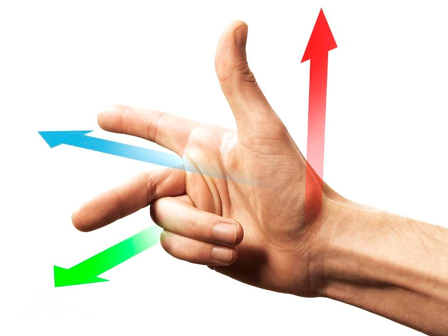

# Creating Objects

Now we have our template of the plugin and have some knowledge on what is going on, let's start working on object creation. Without any objects in the environment, we cannot do anything with it.

## Review

Before we start adding code into the plugin, let's review what is an ECS. Please refer to this [page](../Core_Concepts/entity_component_system.md).

In short, we need to have ID for each object that is associated with each graphic itself.

## Adding packages/libraries/crates

Insert the following packages/libraries/crates (We will call them crates for now on) into the very top of `lib.rs` file.

```rust
use cimvr_engine_interface::{make_app_state, prelude::*, pkg_namespace};

use cimvr_common::{
    render::{
        Mesh,
        MeshHandle,
        Primitive,
        Render,
        UploadMesh,
        Vertex,
    },
    Transform
};
```
Some of the crates are familiar from the plugin template such as `make_app_state` or `prelude::*`. Here is a brief summary on the remaining crates.
- `pkg_namespace`: This allows us to easily and uniquely name component and message data types based on our crate's (plugin's) name.
- `cimvr_common`: The main crate that handles communcation between server and client.
    - `render`: The main crate for object loading part (the main itself explains that it will render graphics)
        - `Mesh`: This will contain both vertices and indices: **This will be important later on the object creation part**.
        - `MeshHandle`: This handle refers to a mesh without containing its data
        - `Primitive`: This will describe the method of rendering the object: **This is important when it comes to object creation**.
        - `Render`: This component is the most important for rendering; it tells the rendering engine how to render the given `MeshHandle`.
        - `UploadMesh`: This will send the mesh to the client.
        - `Vertex`: It contains the coordinates and rgb value and/or texture coordinates for a given vertex.
    - `Transform`: The will set the position and orientation of the object.

## Create ID For Each Object

First, we need to declare the `MeshHandle` to assign each ID for each object. In the game of galaga, we need to assign four parts: player, enemy, player's bullet, and enemy's bullet.

We can set up the ID value like the following.
```rust
const PLAYER_HANDLE : MeshHandle = MeshHandle::new(pkg_namespace!("Player"));
const ENEMY_HANDLE : MeshHandle = MeshHandle::new(pkg_namespace!("Enemy"));
const PLAYER_BULLET_HANDLE : MeshHandle = MeshHandle::new(pkg_namespace!("Player Bullet"));
const ENEMY_BULLET_HANDLE : MeshHandle = MeshHandle::new(pkg_namespace!("Enemy Bullet"));
```
Each line represents the ID for each entity/object. We will declare a constant value that it is a MeshHandle with the name holder of the object using the `pkg_namespace`. 
These variables should not be declare in ServerState nor ClientState.

## Setting up the Mesh for Each Object
Now we have declare the MeshHandle, we need to create the Mesh itself, or the object itself.

If you want to use `Blender` to create an object and upload that as a mesh into the plugin, please refer Setting up the Mesh for Each Object using Object Loader from Blender section that is below this section.

Let's start making the player object itself. Our design, since it is a basic model, will be a sqaure for the player.
First, we declare a function that returns a Mesh type.
```rust
fn player() -> Mesh {}
```

Inside the function, we need to define how big we want to be.
For now, let's define the size variable inside the player function as 5.0.

```rust
fn player() -> Mesh {
    let size = 5.0;
}
```
Inside a Mesh, there is vertices and indices that we need to define and return.
Let's take a look at the Vertex data type.
```rust
pub struct Vertex {
    /// Local position
    pub pos: [f32; 3],
    /// Either u, v, w for textures or r, g, b for colors
    pub uvw: [f32; 3],
}
```
As you see above, the Vertex takes [x,y,z] position and [r,g,b] color combination.
The word vertex means a point. We are poviding the point value of the object. Because we decided to make the player as a sqaure rather than fancy object looking, it can define as the following.
```rust
let vertices = vec![
        Vertex::new([-size, -size, 0.0], [0.0, 0.0, 1.0]), // Vertex 0
        Vertex::new([size, -size, 0.0], [0.0, 0.0, 1.0]), // Vertex 1
        Vertex::new([size, size, 0.0], [0.0, 0.0, 1.0]), // Vertex 2
        Vertex::new([-size, size, 0.0], [0.0, 0.0, 1.0]), // Vertex 3
    ];
```
The variable vertices is vector that contains several vertext of the object itself.
Inside the first Vertex variable, the first array is define as the position of the vertex location whereas the second array is the rgb value. Since we define the value `size` previously, we can use the value in the x and y value. We are not creating a 3D galaga game, which there is no need to insert a z value. Therefore, the z value is `0.0` rather than some other numerical value.

For the rgb value, we are using the scale between 0.0 to 1.0 rather than the traditional of 0 to 255. If you want to get the exact value of the rgb value based on the scale between 0 to 255, you can simply do the value desire over 255. For example, if you want to have a certain red value (like 200), the math will be 200/255 which results to 0.7843137255. In this case, we are setting the player object as blue.

Now let's switch our focus to the indices. We need to place the vertex by following the **Right Hand Rule**. For people who do not know what is the Right Hand Rule, it can be explain the image below.



Let's say the green arrow represents the x-axis, the blue arrow represents the y-axis, and the red arrow represents the z-axis. If we place the vertex in the counter clockwise order for both x and y values, then the z value will be positive that will be facing us. If we place the order of the vertex in the opposite order/ clockwise, then it will face down. Since we want to place the object facing toward us, we need to place the vertices in the counter clockwise order.

Therefore, the indices variable will be define as below.
```rust
let indices: Vec<u32> = vec![0,1,2,2,3,0];
```
The 0, 1, 2, 3 came from the Vertex 0, Vertex 1, Vertex 2, and Vertex 3 that is describe above. Vertex 0 is the bottom left corner; Vertex 1 is the bottom right corner; Vertex 2 is upper right corner; and Vertex 3 is the upper left corner of the square.

Here is an example drawing on how it will be displayed.


Lastly, we need to return the value of Mesh type as the following.
```rust 
Mesh {vertices, indices}
```

Therefore the complete version of the player mesh function will be define as following.

```rust
fn player() -> Mesh {
    let size: f32 = 5.0;

    let vertices = vec![
        Vertex::new([-size, -size, 0.0], [0.0, 0.0, 1.0]), // Vertex 0
        Vertex::new([size, -size, 0.0], [0.0, 0.0, 1.0]), // Vertex 1
        Vertex::new([size, size, 0.0], [0.0, 0.0, 1.0]), // Vertex 2
        Vertex::new([-size, size, 0.0], [0.0, 0.0, 1.0]), // Vertex 3
    ];

    let indices: Vec<u32> = vec![0,1,2,2,3,0];

    Mesh {vertices, indices}
}
```
For each object, we need to the followng for the remaining enemy. enemy's bullet, and player's bullet. If you want to learn more depth regarding drawing objects, here is a [great resource](https://learnopengl.com/Getting-started/Hello-Triangle) to refer.

## Sending the Mesh from Client to Server
Once we have generated the Mesh for each object with the correct entity ID, we need to send that Mesh with the correct ID to the server. Inside the new function below, we need to insert the following command.

```rust
io.send(&UploadMesh{
    id: PLAYER_HANDLE,
    mesh: player(),
});

```
Let's take a deep look into this command itself.

The command will send to the EngineIo as a `UploadMesh` struct that contains the entity ID and the mesh itself. We know both of the id (`PLAYER_HANDLE`) and the mesh (`player()`). 

That is all for sending mesh from the client to the server. Pretty easy. The complete code will be looking similar below.

```rust
fn new(io: &mut EngineIo, sched: &mut EngineSchedule<Self>) -> Self {
        io.send(&UploadMesh{
            id: PLAYER_HANDLE,
            mesh: player(),
        });

        Self
}
```
You do the same process for all the remaining objects such as the enemy, enemy_bullets, and the player_bullets.

## Setting up the Mesh for Each Object using Object Loader from Blender
While using Mesh is great by declearing a type and modify from there, it is very limited to the extend of creating more unique objects. Therefore, we have a different method to implement mesh into the plugin using `Blender`!

First, please download the file from this [repository](https://github.com/ChatImproVR/obj-parser). In this repository, you will get a source code something similar to the following below.
```rust
use cimvr_common::render::{Mesh, Vertex};
use cimvr_engine_interface::{dbg, prelude::*};
use std::{io::Read, str::FromStr};

use cimvr_engine_interface::{make_app_state, prelude::*, println};

/// Read OBJ lines into the mesh
/// OBJ line specs: https://all3dp.com/1/obj-file-format-3d-printing-cad/
pub fn obj_lines_to_mesh(obj: &str) -> Mesh {
    "and the remaining code..."
}
```

We primarily want to use the `obj_lines_to_mesh` function. We want to store this code into a seperate file. Let's call it `obj.rs`.
Here is the following outline now your repository should look like.
- `.cargo`
    - `config.toml`
- `src`
    - `assets`
        - `circle.obj`
        - `circle.blend`
    - `lib.rs`
    - `obj.rs`
- `.gitignore`
- `Cargo.toml`
- `README.md`

In order to add the `obj_lines_to_mesh` function into our plugin, all we need to add the following statement: `mod obj;`. The following will be the up-to-date version of packages and libraries.

```rust
use cimvr_engine_interface::{make_app_state, prelude::*, pkg_namespace};

use cimvr_common::{
    render::{
        Mesh,
        MeshHandle,
        Primitive,
        Render,
        UploadMesh,
        Vertex,
    },
    Transform
};

mod obj;
```

## How to create an Object in Blender (Very Important)

There is a certain step that must happen in order to load the object correctly. However, I forgot to do this. Therefore, can someone else write this part of the documentation? You do not need to load how to cut an object, make a shape, or the extra. But we need the export process part.

## How to send an Object from Blender from Client to Server
The process of sending a object mesh from Blender from client to server is very similar like how you send a mesh that is created inside the plugin. Inside the `new` function, insert the following code.
```rust
io.send(&UploadMesh {
            id: ENEMY_HANDLE,
            mesh: obj::obj_lines_to_mesh(include_str!("assets/circle.obj")),
        });
```

The only difference between the previous method and this method is the `mesh` component: instead of custom created mesh, we are using the `obj.rs`'s function to load the mesh. All you need to add into the parameter for the `obj_lines_to_mesh` function is the path of the object we want to load for that entity. Since we have created a circle object for the enemy, we want to load the `circle.obj` file.

Once that is complete, then we have sent the entity ID and mesh to the server. For this plugin, I am going to use player and enemy from the object loader function whereas all the bullet related are from the plugin/coded.

## How to display the Object from the Server

## Wait...? What about the bullets?

## Configuring the Camera Angle

## Configuring the Camera Angle (Advanced)

## Summary/Current Code Progress