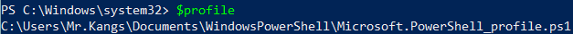

# Setting up Plugin Development Environment

Plugins are typically developed in their own repositories or folders.

## Before plugin development
Before we start doing any plugin development, we need to set up the engine into your machine. Please refer to the [Development Environment](../Product_Page/dev_env.md) before we start setting up the plugin development environment.

## Using the template
The easiest way to get started is to fork the 
[plugin template repository](https://github.com/ChatImproVR/template).

[](https://github.com/ChatImproVR/template)

If you're using another git service besides github, you can clone the repository and remove the default remote:
```sh
git clone git@github.com:ChatImproVR/template.git
cd template
git remote remove origin
```

## Setting up the helper script
The helper script is intended to make it easy to run the client, server, or both from a single command. The script requires Python 3.

### On Linux/Unix/MacOS (Bash)

If your MacOS system is using `bash` instead of `zsh`, then please follow this procedure. Otherwise, please follow the MacOS (Zsh) section.

Assuming you have a copy of `iteration0` somewhere (in this case, `$HOME/Projects/chatimprovr`), you can put the following in your `~/.bashrc`:

```bash
function cimvr() {
    $HOME/Projects/chatimprovr/cimvr.py $@
}
```
This will allow you to access the script as `cimvr` anywhere.

> *NOTE: If you do not have the .bashrc file, you need to create on in the $HOME directory.*

let's say we want to develop a plugin called `foo`, that we're developing at `$HOME/Projects/foo`. Then we could add this to our `~/.bashrc`:
```bash
export CIMVR_PLUGINS="$HOME/Projects/foo"
```

If you are developing on several plugins at the same time, for example `foo` and `poo` and `foo` is located in the `$HOME/Projects/foo` whereas the `poo` is located in the `$HOME/Desktop/foo`, then it will be seperated by the `;` sign.
```bash
export CIMVR_PLUGINS="$HOME/Projects/foo;$HOME/Desktop/poo"
```

### On MacOS (Zsh)

Assuming you have a copy of `iteration0` somewhere (in this case,  `$HOME/Desktop/Rust/chatimprovr`), you can put the following in your `~/.zshrc`:

```zsh
function cimvr() {
    $HOME/Desktop/Rust/chatimprovr/cimvr.py $@
}
```
This will allow you to access the script as `cimvr` anywhere.

> *NOTE: If you do not have the .zshrc file, you need to create on in the $HOME directory.*

let's say we want to develop a plugin called `foo`, that we're developing at `$HOME/Desktop/Rust/foo`. Then we could add this to our `~/.bashrc`

```zsh
export CIMVR_PLUGINS="$HOME/Desktop/Rust/foo"
```

If you are developing on several plugins at the same time, for example `foo` and `poo` and `foo` is located in the `$HOME/Projects/foo` whereas the `poo` is located in the `$HOME/Desktop/foo`, then it will be seperated by the `;` sign.
```zsh
export CIMVR_PLUGINS="$HOME/Desktop/Rust/foo;$HOME/Desktop/poo"
```

### On Windows
Assuming you have a copy of `iteration0` somewhere (in this case, `C:\Users\dunca\Documents\iteration0`), you can put the following in your `Microsoft.PowerShell_profile.ps1`.

```ps1
function cimvr() {
    $cimvr_path="C:\Users\dunca\Documents\iteration0"
    python $cimvr_path\cimvr.py $args
}
```
This will allow you to access the script as `cimvr` anywhere.

> *NOTE: If you cannot find the `Microsoft.PowerShell_profile.ps1`, you can find the file by typing `$profile` in Windows PowerShell. There is a chance that `Microsoft.PowerShell_profile.ps1` might not exist yet. In that case, you need to create a new file and the directory to match that path. In the image below, the file should be located in `Documents\WindowsPowerShell` under the file name as `Microsoft.PowerShell_profile.ps1`. If running scripts is disabled on your machine, consult the common fixes section.*



Let's say we want to develop a plugin called `foo`, that we're developing at `C:\Users\dunca\Documents\Projects\foo`. Then we could add this to our `$profile`:
```ps1
$Env:CIMVR_PLUGINS="C:\Users\dunca\Documents\Projects\foo"
```
If you are developing on several plugins at the same time, for example `foo` and `poo` and `foo` is located in the `C:\Users\dunca\Documents\Projects\foo` whereas the `poo` is located in the `C:\Users\Mr.Kangs\Desktop\poo`, then it will be seperated by the `;` sign.
```ps1
export CIMVR_PLUGINS="C:\Users\dunca\Documents\Projects\foo;C:\Users\Mr.Kangs\Desktop\galaga"
```


### Using the script to launch plugins
After building both `iteration0`'s client and server as well as the example plugins, we could launch the cube example included with ChatImproVR using:
```bash
cimvr camera cube
```

After building our own plugin we could launch it with:

```bash
cimvr foo
```

This will start the client and the server with our plugin as arguments. Note that this name `foo` is determined via package name, the one we set earlier.

The `CIMVR_PLUGINS` environment variable is a semicolon-seperated list of search paths. We've set it to `target/wasm32-unknown-unknown/release` under our own plugin, so that it can find `foo.wasm`.

Note that the `example_plugins` directory will be looked for by default, so you don't need to add an environment variable for these.

## Tips and tricks
### Using the cargo-watch crate
Running e.g. `cargo watch -x 'build --release'` in your plugin's root will compile it automatically when you save the source. In turn, the engine will reload your plugin automatically. This means you can effectively save source or assets and see the result immediately!
