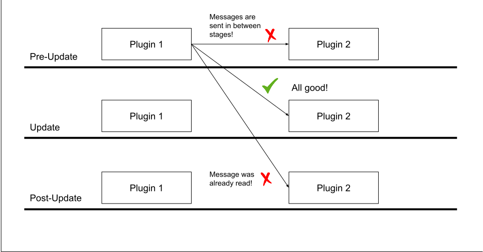
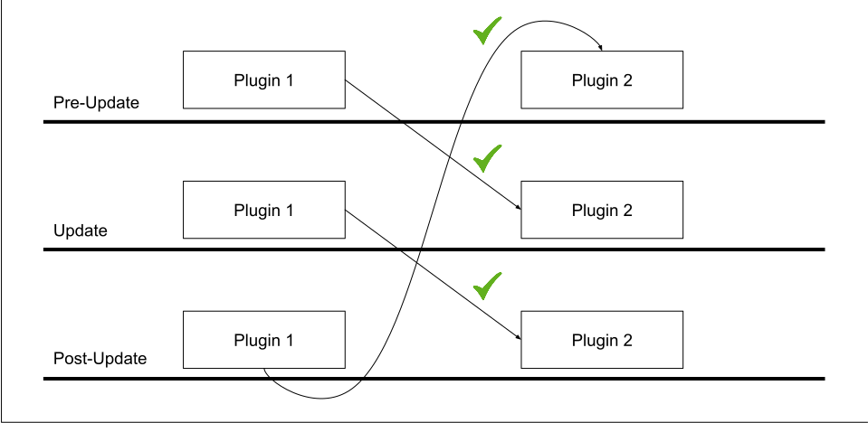
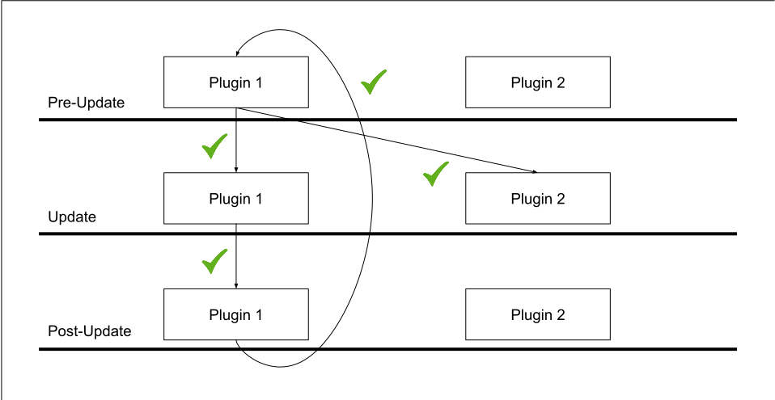
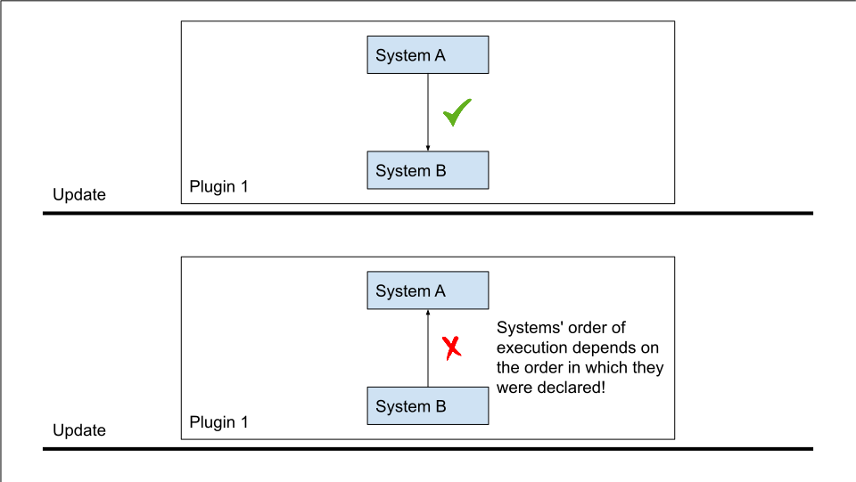
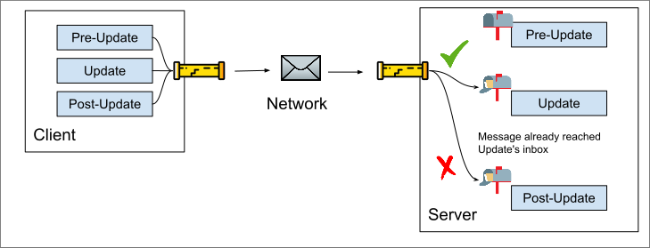

# Pub/Sub channels
ChatImproVR uses the [Publish-Subscribe pattern](https://en.wikipedia.org/wiki/Publish%E2%80%93subscribe_pattern). 

## Receiving messages
Each System subscribes to a number of channels:
```rust
// Schedule the update() system to run every Update,
// and allow it to receive the MyMessage message
sched.add_system(
    Self::update,
    SystemDescriptor::new(Stage::Update)
        .subscribe::<MyMessage>(),
);
```

Here we have subscribed to the `MyMessage`, which will be read every Update when `update()` is called. 

We can read messages from within the system like so:
```rust
fn update(&mut self, io: &mut EngineIo, _query: &mut QueryResult) {
    // Dump the message to the console
    for msg in io.inbox::<MyMessage>() {
        dbg!(msg);
    }
}
```

Server-side, we can get some additional information per-message:
```rust
fn update(&mut self, io: &mut EngineIo, _query: &mut QueryResult) {
    // Dump both the message AND the client that sent the message to the console. 
    // This is only relevant for servers!
    for (client, msg) in io.inbox_clients::<MyMessage>() {
        dbg!((client, msg));
    }
}
```

## Sending messages
Suppose `MyMessage` has the following type:
```rust
#[derive(Serialize, Deserialize, Debug)]
struct MyMessage {
    a: i32,
    b: f32,
}
```
> Note that we derive the `Serialize` and `Deserialize` traits.

We can send the message using the `io.send()` function:
```rust
io.send(&MyMessage {
    a: 9001,
    b: 1337.0,
});
```

Just as we can receive messages with their client IDs on the server, we can also send messages to specific client IDs from the server:
```rust
io.send_to_client(&msg, client.id);
```

Here we might have obtained `client.id` from the `Connections` [message](TODO: LINK ME TO THE API DOCS!).

## Defining message types
We need to give our message a universally unique name.
```rust
impl Message for MyMessage {
    const CHANNEL: ChannelIdStatic = ChannelIdStatic {
        // Here we define the universally unique name for this message.
        // Note that this macro simply concatenates the package name with the name you provide.
        // We could have written "channels_example/MyMessage" or even "jdasjdlfkjasdjfk" instead.
        // It's important to make sure your package name is UNIQUE if you use this macro.
        id: pkg_namespace!("MyMessage"),
        // Sent to server
        locality: Locality::Remote,
    };
}
```

Note how we have specified the `Locality` of this message type. `Local` messages are sent to other plugins on this host. `Remote` messages are sent to the remote host. For example, a `Remote` message sent from a client would be received _only_ at the server.

## Local communication:
Messages are sent between stages, not within stages. Messages may only be received once:


Messages may be sent and received each stage, even to the stage on the next frame:


Messages are broadcasted to all subscribing plugins, including your own plugin:


Systems' order of execution is the same as the order in which they were declared:


## Remote communication
All Remote messages are sent at the end of each frame.

