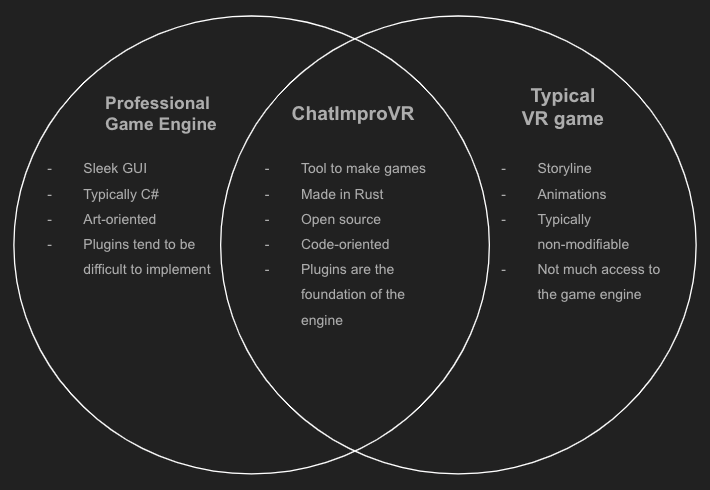

# ChatImproVR

[Insert the FC racing gif to pop off]

## What is ChatImproVR?
ChatImproVR is a virtual world platform, with goals similar to that of VRChat, Neos, or SecondLife. A virtual world platform is a game engine and a set of tools to create and experience an immersive virtual space. These virtual spaces are then hosted online, where users can join them to socialize and enjoy the activities in the virtual world.

ChatImproVR will improve on existing virtual world platforms by promoting open source software and prioritizing user control over content, all while featuring excellent flexibility.

For a one line description about ChatImproVR is **A Game Engine for developing Virtual Worlds using a Plugin Architecture.**

Here is a simple summary version of what is ChatImproVR.

## Who is ChatImproVR for?
Everyone! However, let's be more specific about it.

**Developer**: A user who works with the backend of the engine. Writing code, implementing plugins, etc. 

**Player**:  Uses the front end of the engine. Puts on the VR headset, navigates the spaces, interacts with other users, etc.

## What does ChatImproVR do?
The basic idea of ChatImproVR is another game engine. However, there are many differences between ChatImproVR game engine and others. Here is a visualization about the comparison.

To break it down, ChatImproVR provides a flexible architecture specifically tailored to the creation of virtual worlds; ChatImproVR is an open source code; and ChatImproVR is written in Rust.

What makes ChatImproVR unique than other game engines are the following:
1. Most of the existing virtual world engines are based on existing game engines, and must work within their specific framework whereas ChatImproVR does not have any limits.
2. Because the code is open source code rather than licenses/subscription based game engine, anyone who has an interest can play, develop, and share with the community without any legal action such as sharing their own plugins and private servers that are hosted by the players.
3. Rust is known to be one of the popular programming language that has continous updates to increase efficienty such as security features, memory cleanup compared to C#. On top of that, the Rust community is an very enthusiastic community for developers which provide less friction on converting ideas to plugins.

Here are some example plugins for virtual world environment.

[Demo room or galaga here]

## How do I get started?

While this page serves as a product page, it also serves as the documentation page as well. The next section will cover the installation for the **players**. 

However, if you are planning to do some plugin development or engine development (being as a **developer**), then we would recommend to check out in the Development Environment section.

## Where can I find help?

* Whom can I contact to learn more?

* Who are the personnel of this project?

