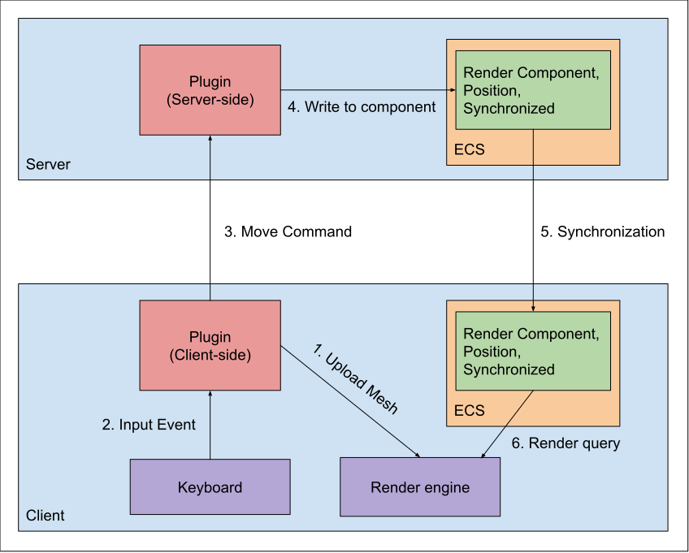

# Client and Server
The client and server play very different roles in plugin developement. Deciding which code belongs server-side and which code belongs client-side can be challenging.

A simple description of the difference in semantics between client and server, is that changes made client-side will only be visible for that client, and changes made server-side can be made visible to **all** connected clients.

For example, let say that a user presses the left key to move an object to the left. If we want that behavior to only be visible for that user, then that code should be part of the client side and we do not need to send a message to the server to change the object. However, if the user wants to move an object which is visible to everyone else in the server, then that movement behavior should happen server-side; The client will send a command to the server requesting that the object must move left.

Therefore, it is worth thinking about the desired behaviors first; If you are planning to develop a plugin that multiple users will interact at the same time, then it is recommended to develop the bahavior of the event on the server-side. If you are planning to develop a story mode game, for example, that only one user will interect with other objects, developing the code client side would make sense and likely result in simpler code.

# Update cycles and the Synchronized component
Many applications in ChatImproVR will have a structure like this:

We explain each step in this process below:
1. On initialization, the client-side plugin uploads mesh data to the render engine, in preperation for the cycle. Note that this will not show anything on screen, because there is no entity in the client-side ECS yet.
2. The client-side plugin receives an input even describing e.g. a key press.
3. The client-side plugin processes the event, and sends a corresponding movement command to the server-side plugin.
4. The server-side plugin processes the movement command and writes to the server-side ECS database. Note that the entity includes a Render Component and position, which describe which mesh to render and where it should be displayed in the world. Critically, the entity also includes the Synchronized component, which instructs the server to perform the next step:
5. The ECS data on the server is copied to the client-side ECS. Any existing components on the corresponding entity will be overwritten. This process is called Synchronization, and it happens automatically for entities which include the Synchronized component.
6. The render engine queries the client-side ECS database, and displays the entity.

The responsibilities of the Plugin are as follows:
* Client-side
    * Upload mesh data
    * Receive input events
    * Publish movement commands corresponding to input events
* Server-side
    * Receive movement commands and update the ECS accordingly
