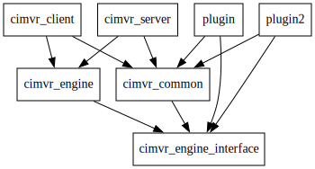

# Crates
The following dependency graph illustrates how the crates in ChatImproVR are laid out:

Most notably, plugins depend on both `cimvr_common` and on `cimvr_engine_interface`. 

The crates in ChatImproVR are as follows:
* `client`: Client application, provides rendering, input, and other user interfacing
* `server`: Server application, a headless service
* `engine`: WASM Plugin, ECS, and messaging layer for use in implementing server and client
* `engine_interface`: Engine interface for use within e.g. plugins
* `common`: Interfacing data types between provided plugin, client, and server e.g. position component
