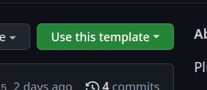

# Getting started with plugin development
## Using the template
The easiest way to get started is to fork the 
[plugin template repository](https://github.com/ChatImproVR/template)



If you're using another git service besides github, you can simply clone the repository and remove the default remote:
```sh
git clone git@github.com:ChatImproVR/template.git
cd template
git remote remove origin
```

The next step is to change the name of your package in `Cargo.toml`:
```toml
[package]
name = "template_plugin" # CHANGE ME!
```

This will become important later when you use the `pkg_namespace!()` macro! Make sure to pick something descriptive, unique, and long.

## Setting up the helper script
The helper script requires Python 3.

### On Linux
Assuming you have a copy of `iteration0` somewhere (in this case, `$HOME/Projects/chatimprovr`), you can put the following in your `~/.bashrc`:

```bash
function cimvr() {
    $HOME/Projects/chatimprovr/cimvr.py $@
}
```
This will allow you to access the script as `cimvr` anywhere.

let's say we want to develop a plugin called `foo`, that we're developing at `$HOME/Projects/foo`. Then we could add this to our `~/.bashrc`:
```bash
export CIMVR_PLUGINS="$HOME/Projects/foo/target/wasm32-unknown-unknown/release"
```

### On Windows
Assuming you have a copy of `iteration0` somewhere (in this case, `C:\Users\dunca\Documents\iteration0`), you can put the following in your `$profile`
```ps1
function cimvr() {
    $cimvr_path="C:\Users\dunca\Documents\iteration0"
    python $cimvr_path\cimvr.py
}
```
This will allow you to access the script as `cimvr` anywhere.

let's say we want to develop a plugin called `foo`, that we're developing at `C:\Users\dunca\Documents\Projects\foo`. Then we could add this to our `$profile`
```bash
$Env:CIMVR_PLUGINS="C:\Users\dunca\Documents\Projects\foo\target\wasm32-unknown-unknown\release"
```

### Use the script to launch plugins
We could launch the cube example included with ChatImproVR using:
```bash
cimvr camera cube
```

After building both `iteration0`'s client and server, and also building our own plugin we could launch our script with the following:

```bash
cimvr foo
```

This will start the client and the server with our plugin as arguments. Note that this name `foo` is determined via package name, the one we set earlier.

The `CIMVR_PLUGINS` environment variable is a semicolon-seperated list of search paths. We've set it to `target/wasm32-unknown-unknown/release` under our own plugin, so that it can find `foo.wasm`.

Note that the `example_plugins` directory will be looked for by default, so you don't need to add an environment variable for these.

## Tips and tricks
### Use the cargo-watch crate
Running e.g. `cargo watch -x 'build --release'` in your plugin's root will compile it automatically when you save the source. In turn, the engine will reload your plugin automatically. This means you can effectively save source or assets and see the result immediately!
