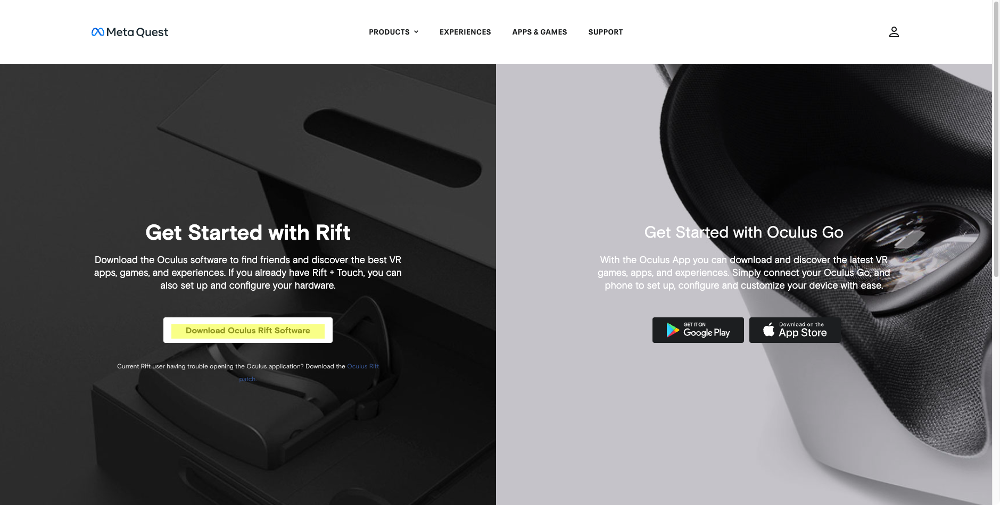

# Installation
This section primarly focuses on installing our ChatImproVR engine.

## Minimum Requirement
As of now, the engine operates on Windows, Mac, and Linux, but it only operates Windows System for VR.  

At the same time, the engine has been tested on two seperate VR headsets: Oculus/Meta Quest and SteamVR. 

If you are using a different system, please refer to [this page](https://github.com/ChatImproVR/chatimprovr/issues/82) for operating system updates. We will update this page as much as possible when additional support is provided. 

While we said that it only works on Windows operating system for the two VR headsets, there is still hardware equipment.

When it comes to hardware requirements, your PC must able to support VR software. For example, the Oculus/Meta headset must need to connect the PC. (Trust us... our primary developers tested this on a weak laptop, and it says that it cannot run that application to connect the headset). Please make sure that the headset supported software is able to run and connect the headset. 

## Softwares to Download
There are two softwares to download: the VR connector app and our engine. 

## Oculus VR
Once you [open the page](https://www.oculus.com/Setup/), you will be greet the follow page as below.

Select the `Download Oculus Rift Software` button. By selecting the button will open an `.exe`. Please follow the installation instructions provided on the Oculus website.

// Need to write more

## Steam VR
Open the [Download Link](https://store.steampowered.com/app/250820/SteamVR/), and install the Steam VR application.

## Our Engine
If you want to use the stable version, we recommend to download the engine from releases. You can download from [here](https://github.com/ChatImproVR/chatimprovr/releases). If you are a **Windows** user, please download the `.exe`. If you are a **Linux** or **Mac**, please download the file that is stated in the release note (The application that has no extension). From there, you can either run the `cimvr_server.exe` to host your own server, or the `cimvr_client.exe` to connect server based on the address of the server.

If you want to use the most up-to-date with some minor bugs, check out the experimental version on the [development environment page](./development_environment.md).
