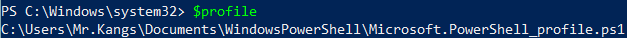

# Installation
This section primarly focus on installing our ChatImproVR engine.

## Minimum Requirement
As of now, the engine operates only on Windows Operating System.  

At the same time, the engine has been tested on two seperate VR headsets: Oculus VR and SteamVR. 

Therefore, if you have a different system, please refer to [this page](https://github.com/ChatImproVR/chatimprovr/issues/82) to see any updates with it. We will update this page as soon as possible if there is a new method for additional support. 

While we said that it only works on Windows operating system for the two VR headsets, there is still hardware equipment.

We cannot provide the most accurate requirement; however, the PC must able to run the VR supported Softwares. For example, the Oculus VR headset must need to connect the PC. (Trust me, I(Ken) has tested on a weak laptop, and it says that it cannot run that application to connect the VR headset). Please make sure that the VR headset supported software is able to run and connect the headset. 

## Softwares to Download
There are four softwares to download in order to use the ChatImproVR.
1. [Rust](#rust)
2. [CMake](#cmake)
3. VR Supported Headset Software
   1. [Oculus VR](#oculus-vr)
   2. [Steam VR](#steam-vr)
4. Our Engine
   1. [Stable Version Environment](#stable-version)
   2. [Development Environment](#most-advanced-version-development-environment-version)

We will guide you how to install for each software to be ready to use our engine. Before you go into the installaion, please open the links that are provided above.

## Rust
When you visit the page for Rust, it will greet you the screen as below.


Please follow the instructions as they stated. The page might look slighlty different based on operating system.

## CMake
When you visit the [page for Cmake](https://cmake.org/download/), it will greet you the screen as below. Please download the latest version of Cmake that has the option of Windows x64 Installer: the file extension is `.msi`.

In the image above, the version we are downloading is 3.26.4, but you can download and install a higher version if you want as well.

Once you download the installer, open the installer. The first screen should be similar as the following screen.


Select `Next` to continue the installation process.

The next screen will ask regarding the agreement of the program. Select agree to continue the installation process as the image below. You can save the agreement by selecting the `print` option if you want.


In the next screen, we are have an option to install on system path for current user, all users, or not at all. Choose either for the current user or all users to add the system PATH. The image below has selected for all users.


The next screen is selection the program path. The image below has selected the default path, but you can choose whatever path you want.


The next screen is an verifier on selecting all the correct options that you have selected. Once everything is all set, click the `install` button to proceed the installation.


Once the installation is complete, then you will see the following screen.


## Oculus VR
Once you [open the page](https://www.oculus.com/Setup/), you will be greet the follow page as below.


Select the `Download Oculus Rift Software` button. By selecting the button will open an `.exe`. Please follow the installer instruction.

## Steam VR
//TODO: someone test this out/write this part. I have no idea what is a major difference when it comes to Steam VR application.
[Download Link](https://store.steampowered.com/app/250820/SteamVR/)

## Our Engine
There are two methods to use our engine: the stable version and most advanced version.

### Stable Version
If you want to use the stable version, we recommend to download the engine from releases. You can download from [here](https://github.com/ChatImproVR/chatimprovr/releases). If you are a **Windows** user, please download the `.exe`. If you are a **Linux** or **Mac**, please download the file that is stated in the release note (The application that has no extension).From there, you can run the `cimvr_server.exe` to host your own server whereas the `cimvr_client.exe` to connect server based on the address of the server.

### Most Advanced Version (Development Environment Version)
If you want to get the most up-to-date version that might have some bugs within the engine but has more features than the stable version and develop new plugins or engine features, then we recommend to clone our repository from [here](https://github.com/ChatImproVR/chatimprovr). There are additional steps that need to finish in order to use this version.

#### WASM target
Make sure you have the `wasm32-unknown-unknown` target installed;
```sh
rustup target add wasm32-unknown-unknown
```

#### Dependencies on Ubuntu:
```sh
sudo apt install build-essential cmake libxcb-render0-dev libxcb-shape0-dev libxcb-xfixes0-dev libspeechd-dev libxkbcommon-dev libssl-dev
```

#### Compilation
Build the client, server, and example plugins like so:
```sh
pushd server
cargo build --release
popd

pushd client
cargo build --release
cargo build --release --features vr # (For VR/OpenXR support)
popd

pushd example_plugins
./compile_all.sh # (Linux)
# ./compile_all.ps1 # (Windows)
popd
```

You can compile all of the example plugins with the `compile_all.sh` script. 
If you're on windows, you can either use `Git Bash` to run the `.sh` files or open a PR; sorry about it!

While most crates _are_ in a workspace, the client crate is unfortunately excluded due to an issue with the `openxr` crate.

#### Setting up the helper script
The helper script is intended to make it easy to run the client, server, or both from a single command. The script requires Python 3.

##### On Linux/Unix/MacOS (Bash)

If your MacOS system is using `bash` instead of `zsh`, then please follow this procedure. Otherwise, please follow the MacOS (Zsh) section.

Assuming you have a copy of `chatimprovr` somewhere (in this case, `$HOME/Projects/chatimprovr`), you can put the following in your `~/.bashrc`:

```bash
function cimvr() {
    $HOME/Projects/chatimprovr/cimvr.py $@
}
```
This will allow you to access the script as `cimvr` anywhere.

> *NOTE: If you do not have the .bashrc file, you need to create on in the $HOME directory.*

##### On MacOS (Zsh)

Assuming you have a copy of `chatimprovr` somewhere (in this case,  `$HOME/Desktop/Rust/chatimprovr`), you can put the following in your `~/.zshrc`:

```zsh
function cimvr() {
    $HOME/Desktop/Rust/chatimprovr/cimvr.py $@
}
```
This will allow you to access the script as `cimvr` anywhere.

> *NOTE: If you do not have the .zshrc file, you need to create on in the $HOME directory.*

##### On Windows
Assuming you have a copy of `chatimprovr` somewhere (in this case, `C:\Users\dunca\Documents\chatimprovr`), you can put the following in your `Microsoft.PowerShell_profile.ps1`.

```ps1
function cimvr() {
    $cimvr_path="C:\Users\dunca\Documents\chatimprovr"
    python $cimvr_path\cimvr.py $args
}
```
This will allow you to access the script as `cimvr` anywhere.

> *NOTE: If you cannot find the `Microsoft.PowerShell_profile.ps1`, you can find the file by typing `$profile` in Windows PowerShell. There is a chance that `Microsoft.PowerShell_profile.ps1` might not exist yet. In that case, you need to create a new file and the directory to match that path. In the image below, the file should be located in `Documents\WindowsPowerShell` under the file name as `Microsoft.PowerShell_profile.ps1`. If running scripts is disabled on your machine, consult the common fixes section.*



##### Using the script to launch the engine
After building both `chatimprovr`'s client and server as well as the example plugins, we could launch the cube example included with ChatImproVR using:
```bash
cimvr camera cube
```
in the terminal where you installed the helper script.

#### Additional Tips and Tricks
##### Sparse registries
Recently, the sparse protocol for cargo registries was stablized. This can help improve initial compile times. See [the rust blog](https://blog.rust-lang.org/2023/03/09/Rust-1.68.0.html#cargos-sparse-protocol).

##### Logging
Wasmtime/Cranelift puts a bunch of junk in the log by default. To disable this, put the following in your RC file:
```sh
export RUST_LOG="debug,cranelift=OFF,wasmtime=OFF"
```