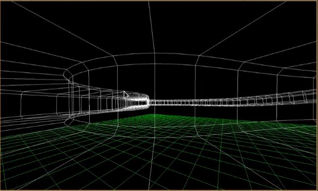
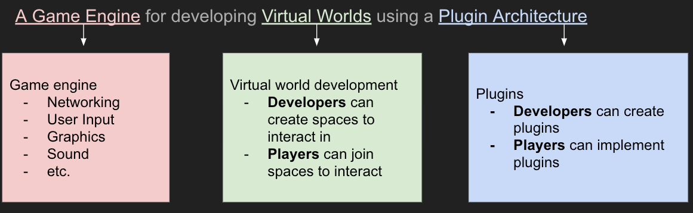
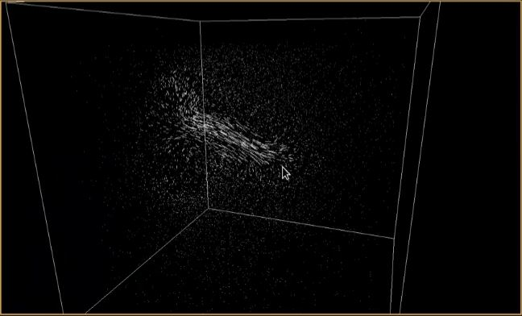

# ChatImproVR

## What is ChatImproVR?

ChatImproVR is a virtual world platform, with goals similar to that of VRChat, Neos, or SecondLife. A virtual world platform is a game engine and a set of tools to create and experience an immersive virtual space. These virtual spaces are then hosted online, where users can join them to socialize and enjoy the activities in the virtual world.

ChatImproVR will improve on existing virtual world platforms by promoting open source software and prioritizing user control over content, all while featuring excellent flexibility.

## Who is ChatImproVR for?
Everyone! But to be more specific, we break down ChatImproVR users into two groups:

1. **Developers**: These are users who work with the backend of the engine. Writing code, implementing plugins, etc. If you are enthusiastic about Rust or developing your own game from scratch, chances are that you're in this developer category.

2. **Player**:  Players use the "front end" of the engine. If you are content to put on the VR headset and just play the game without looking at the code too much, you're likely one of the players.

We want everyone to be able to use ChatImproVR for every aspect of the game experience-- from developing the game to playing it!

## What does ChatImproVR do?

Primarily ChatImproVR is a game engine, but it might be a bit different from the game engines that you are used to, like Unity or Unreal. To break it down, ChatImproVR has a plugin-based architecture. This means that developers can use whatever parts of our engine that they would like, and even add their own features just as easily. The hope is that developers will share the features that they create for the engine, and open-source developers can build the engine _together_, instead of providing game builders with a front end and limited back end. 

|                     | ChatImproVR | Professional Game Engine | Typical VR Game |
| ------------------  | :--------:  | :----------------------: | :-------------: |
| Fully Open Source   |      ✔️     | ✔️  | ❌ |
| Can create games    |      ✔️     | ✔️  | ❌ |
| Visually-focused    |      ❌     | ✔️  | ✔️ |
| Can play games      |      ✔️     | ❌  | ✔️ |
| Plugin architecture |      ✔️     | ❌  | ❌ |
| Code-oriented       |      ✔️     | ❌  | ❌ |
| Made in Rust        |      ✔️     | ❌  | ❌ |

Here are some examples of games that have been created with ChatImproVR so far:

_Demo Room_

_Multiplayer_

_Fluid Simulation_

## How do I get started?   

While this page serves as a product page, it also serves as the documentation page as well. The next section will cover the installation for the **players**. 

However, if you are planning to do some plugin development or engine development (being as a **developer**), then we would recommend to check out in the Development Environment section.

If you are interested in the repository, check out [here](https://github.com/ChatImproVR/iteration0).

## Where can I find help?   

You're pretty much there! The Book is the information hub of ChatImproVR. Here is where you can find How to make your [first plugin](https://chatimprovr.github.io/The-Book/Beginner_Tutorial/beginner_plugin_development_tutorial.html), common issues and their [fixes](https://chatimprovr.github.io/The-Book/common_fixes.html), or even the [core concepts](https://chatimprovr.github.io/The-Book/Core_Concepts/core_concepts.html) of what ChatImproVR is made of.

But just in case The Book doesn't have the help you need, you can also:

* Refer to some of our [example plugins](https://github.com/orgs/ChatImproVR/repositories)

* Report an [issue](https://github.com/ChatImproVR/iteration0/issues) in the ChatImproVR engine repository

* Or, if all else fails, you can contact the devleopers directly:

| Developer Name | Email |
| ----------- | ----------- |
| [Duncan Freeman](https://github.com/Masterchef365) | duncan.freeman1@gmail.com |
| [Rudy Peralta](https://github.com/Exiled1) | rudyperalta831@gmail.com |
| [Kenneth Kang](https://github.com/MrKangs) | gyhang00@gmail.com |
| [Grace Todd](https://github.com/toddgr) | grace.miriam.todd@gmail.com|

